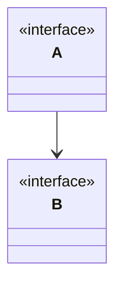

# 反射机制

> 我遇到过很多问题，但是我都会采用拖字诀，最后，我的成就有限。
> 为了改变这一点，我发四，我要改正这个错误的观点。

## 反射机制是什么？

在计算机科学领域，反射是指一类应用。
它们能够自描述和自控制。
也就是说，这类应用
通过采用某种机制来实现对自己行为的描述（self-representation）
通过采用某种机制来实现对自己行为的监测（examination）
并能根据自身行为的状态和结果，调整或修改应用所描述行为的状态和相关的语义。

### 说人话

**我是一个类
我知道我是什么类，我叫什么，我的功能有什么。
我还可以，操作应用对我自己进行某种体检活动。
对于体检活动的检测结果，我会采取另一种类活动。**

### 科学的说话

* 反编译：.class-->.java
* 通过反射机制访问java对象的属性，方法，构造方法等。

## 反射机制的起源

反射的概念是由Smith在1982年首次提出的，主要是指程序可以访问、检测和修改它本身状态或行为的一种能力。这一概念的提出很快引发了计算机科学领域关于应用反射性的研究。它首先被程序语言的设计领域所采用，并在Lisp和面向对象方面取得了成绩。

计算机科学领域的反射不单单指反射本身，还包括对反射结果所采取的措施。

## test

